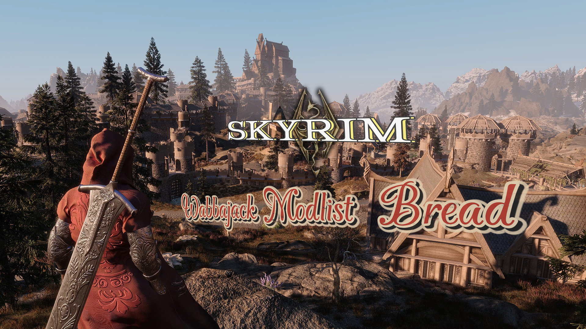

# Bread

My passion project to reimagine Skyrim. Shared for all adventurers to help make every corner and story even more incredible.

**Links**: [Nexus Page](https://www.nexusmods.com/skyrimspecialedition/mods/149063) | [Load Order](https://loadorderlibrary.com/lists/bread-wabbajack-modlist) | [Discord](https://discord.gg/NR322ygvdu) | [Bilibili](https://space.bilibili.com/13654140) 

---

## Contents
- [Introduction](#introduction)
- [System Requirement](#system-requirement)
- [Installation](#installation)
- [Post-Installation](#post-installation)
- [Updating](#updating)
- [Troubleshooting](#troubleshooting)
- [Uninstalling](#post-installation)
- [Credits](#credits)

---

## Introduction
**Bread** is a complete overhaul modlist for Skyrim AE (1.6.1170) with all DLCs, built around [Community Shaders](https://www.nexusmods.com/skyrimspecialedition/mods/86492). It significantly expands content across all aspects (at ~170 esp slots), aiming to breathe lasting vitality into Skyrim while striving to remain lore-friendly.

Additionally, it supports both **English and Chinese**. You can switch the language in MO2 at any time.

It's not perfect and could probably be polished until the day The Elder Scrolls VI comes out. All ideas are welcome.

Before you ask, see if the [FAQ](https://github.com/nowatermelon/skyrim/blob/main/FAQ.md) has the answer. Feel free to reach out on [Discord](https://discord.gg/NR322ygvdu) as well.

---

## System Requirement

---

## Installation
1. **Microsoft**
   - [Visual C++ Redistributable latest version x64](https://learn.microsoft.com/en-us/cpp/windows/latest-supported-vc-redist).
   - [.NET latest version x64](https://dotnet.microsoft.com/en-us/download).

2. **Steam**
   - Purchase [The Elder Scrolls V: Skyrim Anniversary Edition](https://store.steampowered.com/sub/626153) on Steam.
     
     *Note: Wabbajack doesn't work with a pirated version.*
     
   - [Disable auto-updates for Skyrim AE](https://help.steampowered.com/en/faqs/view/71AB-698D-57EB-178C#disable).

   - Set the game language to English.
  
     *Note: This step is required for all players (Chinese translations are implemented via mods).*
   - Upon first launch, Skyrim AE will auto-download the DLCs. Stay on this screen until finished, exit only after it's done.

     *Note: If you encounter an issue where Wabbajack cannot download the base game or DLCs, delete the game folder and redo this step.*

3. **Wabbajack**
    - ~~Seek the Mad God's shrine. Whisper your madness. Claim your chaos. The Wabbajack awaits.~~
    - Download [wabbajack](https://www.wabbajack.org) to a folder on your drive's root (e.g. `D:\Wabbajack`) to avoid errors. Then run `Wabbajack.exe`.
    - Find Bread, click “Download & Install”, set installation and downloads paths (e.g. `D:\Bread` and `D:\Bread\Downloads`) and proceed.

      *Note: Nexus Premium gets automatic downloads; otherwise each mod requires a manual click.*
      
---

## Post-Installation
1. Set MO2 language.

   

2. ***Restore the backups***. It will set the game language at the same time.
  
   

3. To avoid manually configuring many settings (like MCMs and IED) at the start of a new game, I’ve provided a pre-configured save file named “pm” in the `Profiles` folder, meaning all you have to do is use the "Alternate Racemenu" power to redesign your character.
  
   Additionally, I have provided the `Overwrite` folder, which includes some generated files such as the community shader cache.

   They can be downloaded on [Nexus](https://www.nexusmods.com/skyrimspecialedition/mods/149063). You just need to ***download and drop them into the `Bread` folder***.

4. There is a hidden button behind the table in the starting room that can be used to ***skip the prologue***.

5. If you want to modify specific INI files, you can use the `filter` box under the `Data` section on the right panel in MO2, it will directly display the file with the highest priority.
  
   
   
   *Note: Be sure to back up or make notes, as these custom changes are often easily forgotten and may cause issues later on.*

6. Since I play on 16:9 screen with keyboard and mouse, I'm not very familiar with widescreen or controller setups. However, the modlist includes some mods that may be helpful, and you can also ask other players for help.

   *Note: Mods supporting non-16:9 resolutions (partial): Lore-Friendly Load Screen Compendium, Oathvein UI*

Keyboard Layout

*Note: Check the mods' pages for key binding changes and avoid conflicts with the vanilla game, and [Key Code Reference](https://www.nexusmods.com/skyrimspecialedition/articles/7704) may help. Besides, not all keys above are functional. For instance, the `Dialogue History` key no longer works because I removed this mod for stability. But I left it as a reminder.*

7. Directly modifying the root folder (where `SkyrimSE.exe` is) can get messy. Root Builder keeps things organized without touching the original files. This is why many Wabbajack lists (including Bread) use `stock game`, which allows you to modify this copy instead.
   
   *Note: Another way is to create an empty mod, create a folder named "Root" inside it, and place anything you want to put in the `stock game` into that `Root` folder instead. See [Root Builder](https://www.nexusmods.com/skyrimspecialedition/mods/31720) and [Wabbajack Wiki](https://wiki.wabbajack.org/modlist_author_documentation/Keeping%20the%20Game%20Folder%20clean.html) for more.*
   
---

## Updating
Check Changelog for useful information.

The steps are the same as installing Bread, just be sure to use the same paths.

***Note: Any custom files not included in the Modlist will be deleted during updates. To preserve your own edits, you must add the [NoDelete] prefix to these mods' names.***

---

## Troubleshooting
This might be a bit much for here. For details, see the [FAQ](https://github.com/nowatermelon/skyrim/blob/main/FAQ.md).

Includes:
- How do I change the resolution?
- How do I quickly get items from mods?
- I can't level up or fast travel.
- Wabbajack says something failed to download.
- Where are the crash logs?
  
  ... ... ... ... ... ...
  
---

## Uninstalling
Delete the `Bread` folder.

~~Wait... I know you.~~

Wait... Tell me you're not that heartless T_T

---

## Credits
- Todd Howard for It Just Works
- [Halgari](https://www.nexusmods.com/skyrimspecialedition/users/17252164) & Wabbajack team
- All mod authors
- All tool developers
- All friends who have supported and helped me
